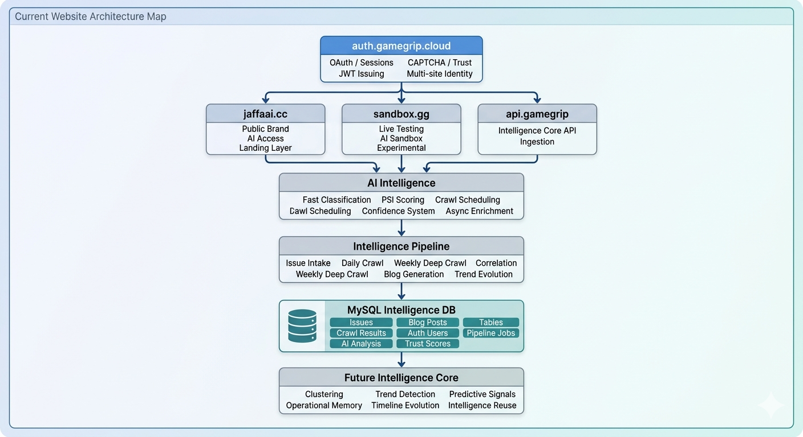

# GameGrip Auth v0.6.1

**Unified SSO authentication** for the GameGrip platform. One account, three services, zero friction.

Part of the [GameGrip](https://gripai.uk) platform.

## Features

- 🔐 **JWT Authentication** — stateless, signed, short-lived access tokens + refresh tokens
- 👥 **Role-based access** — user, developer, admin, studio roles
- 🔑 **API key management** — create/revoke keys for SDK access
- 🤖 **Google reCAPTCHA v2** — bot protection on login and registration
- 🛡️ **Anti-abuse** — honeypot fields, form timing checks, risk scoring
- 🔒 **Hardened** — Helmet CSP, CORS whitelist, rate limiting, no operational leakage

## Quick Start

```bash
# Install
npm install

# Set up environment
cp .env.example .env
# Edit .env with your database credentials and JWT secrets

# Run MySQL schema
mysql -u your_user -p your_db < schema.sql

# Start (development)
npm run dev

# Start (production — Passenger/PM2)
npm start
```

## API Endpoints

### Auth
| Method | Endpoint | Description |
|--------|----------|-------------|
| POST | `/auth/register` | Create account (reCAPTCHA required) |
| POST | `/auth/login` | Sign in (reCAPTCHA required) |
| POST | `/auth/refresh` | Refresh access token |
| POST | `/auth/logout` | Revoke refresh token |
| GET | `/health` | Service health check |

### User (JWT required)
| Method | Endpoint | Description |
|--------|----------|-------------|
| GET | `/user/profile` | Get current user profile |
| PUT | `/user/profile` | Update profile |
| GET | `/user/api-keys` | List API keys |
| POST | `/user/api-keys` | Create API key |
| DELETE | `/user/api-keys/:id` | Revoke API key |

## Project Structure

```
├── app.js                 # Express app (Passenger entry point)
├── server.js              # Standalone server
├── db.js                  # MySQL connection pool
├── middleware/
│   ├── auth.js            # JWT verification + role middleware
│   ├── captcha.js         # Google reCAPTCHA v2 verification
│   └── security.js        # Anti-abuse (honeypot, timing, risk score)
├── routes/
│   ├── auth.js            # Register, login, refresh, logout
│   └── user.js            # Profile + API key management
├── utils/
│   └── jwt.js             # Token generation + verification
├── public/
│   ├── index.html         # Auth portal UI
│   ├── css/style.css      # Dark theme styles
│   └── js/portal.js       # Frontend logic
├── schema.sql             # MySQL schema (generic)
├── schema_cpanel.sql      # MySQL schema (cPanel variant)
└── test/                  # Test suite
```

## Security

- **JWT**: Short-lived access tokens (15m), long-lived refresh tokens (7d)
- **Passwords**: bcrypt hashed (12 rounds)
- **CORS**: Whitelist only — no wildcards
- **CSP**: Strict Content-Security-Policy with reCAPTCHA exceptions
- **Rate limiting**: 20 auth attempts per 15 minutes
- **reCAPTCHA v2**: Required on login and registration
- **Anti-abuse**: Hidden honeypot fields, form timing validation

## Deployment

### cPanel (Passenger)

The `app.js` file is the Passenger startup file. Set in `.htaccess`:
```
PassengerStartupFile app.js
```

### PM2

```bash
pm2 start server.js --name gamegrip-auth
pm2 save && pm2 startup
```

## Tech Stack

- Node.js 18+ / Express 4
- MySQL 8.0+ / MariaDB
- JWT (jsonwebtoken)
- bcryptjs
- Google reCAPTCHA v2

## License

MIT — see [LICENSE](LICENSE)

## Architecture



